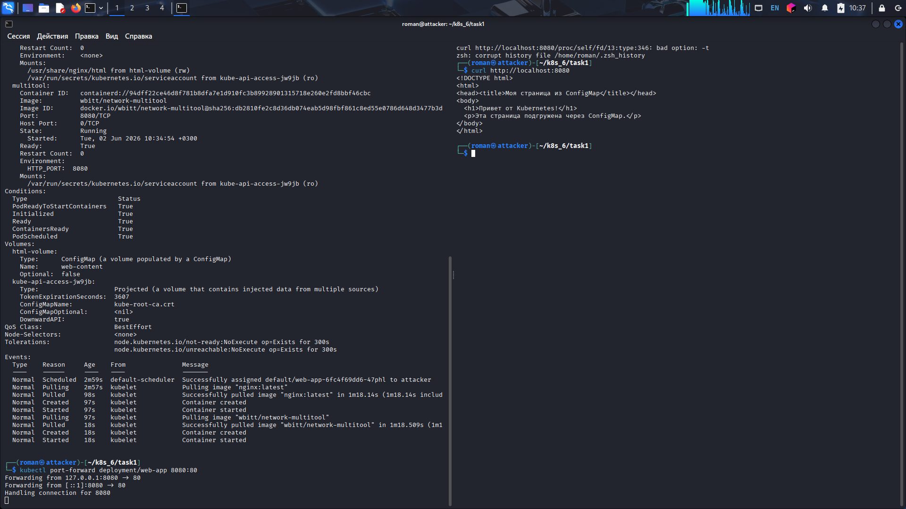
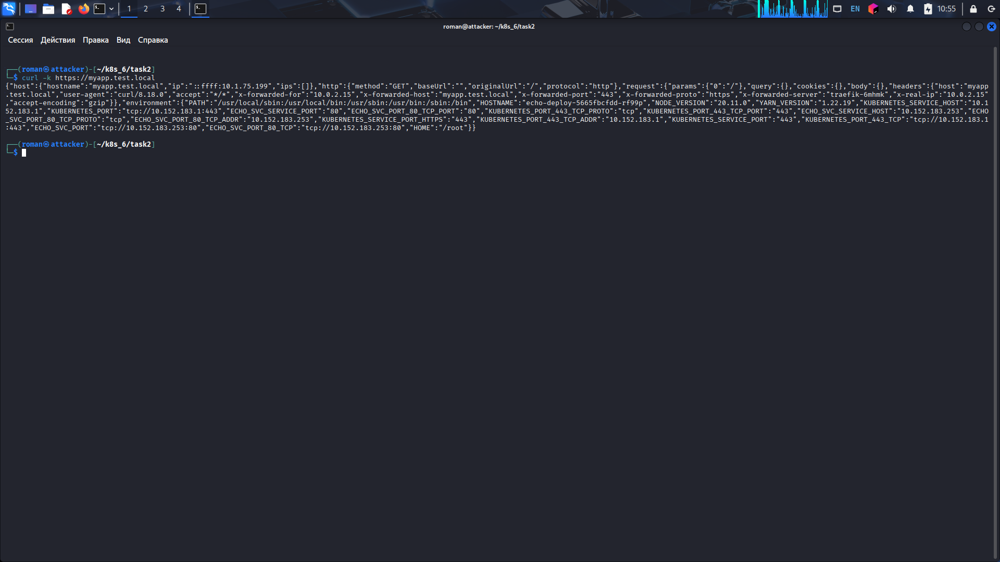
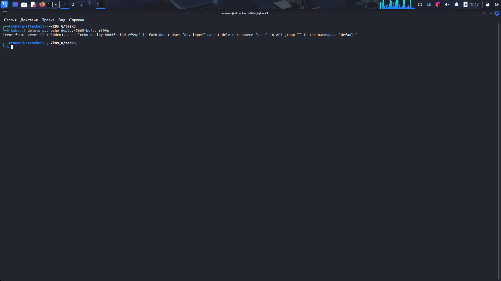

# Домашнее задание: ConfigMap, Secret, RBAC

**Выполнил:** Машаев Роман  
**Кластер:** MicroK8S  

---

## Задание 1. ConfigMap (nginx + multitool)

Развёрнут Deployment с nginx и multitool. Через ConfigMap подключена собственная веб-страница.

- [ConfigMap](./task1/configmap-web.yaml)
- [Deployment](./task1/deployment.yaml)

**Проверка:** `curl http://localhost:8080`

---

## Задание 2. HTTPS через Secret (самоподписанный сертификат)

Создан TLS-секрет, настроен Ingress для домена `myapp.test.local`. Доступ по HTTPS проверен.

- [Deployment + Service (echo)](./task2/echo-deploy.yaml)
- [Ingress с TLS](./task2/ingress-tls.yaml)

**Проверка:** `curl -k https://myapp.test.local`

---

## Задание 3. RBAC (ограниченный пользователь)

Создан пользователь `developer` с правами только на просмотр подов и логов. Role и RoleBinding применены.

- [Role (pod-viewer)](./task3/role-pod-reader.yaml)
- [RoleBinding (developer-pod-viewer)](./task3/rolebinding-developer.yaml)

**Команды для создания пользователя:**

openssl genrsa -out developer.key 2048
openssl req -new -key developer.key -out developer.csr -subj "/CN=developer"
openssl x509 -req -in developer.csr -CA /var/snap/microk8s/current/certs/ca.crt -CAkey /var/snap/microk8s/current/certs/ca.key -CAcreateserial -out developer.crt -days 365
kubectl config set-credentials developer --client-certificate=developer.crt --client-key=developer.key
kubectl config set-context developer-context --cluster=microk8s-cluster --user=developer --namespace=default

Проверка прав:
kubectl get pods --as=developer – успешно
kubectl delete pod <pod> --as=developer – ошибка Forbidden

 
